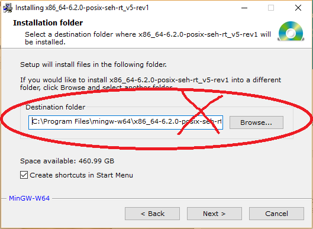

# Configuração do ambiente Matlab para uso do framework MatConvNet (deep learning)

Passo 1: Faça o download da última do MatConvNet versão no site: http://www.vlfeat.org/matconvnet/

Passo 2: Abra o Matlab com privilégios de administrador (Opção disponível ao clicar com botão direito do mouse no link do matlab)

Passo 3: Digite o comando: cd <diretoriodapastaMatConvNet> ou use o navegador de diretórios do Matlab para escolher a pasta onde o framework foi descompactado.

Passo 4: Digite o comando: addpath matlab

Passo 5: Digite o comando: vl_compilenn 

Possível erro: Se você não configurou previamente a compilação de código C no Matlab, você receberá a mensagem de erro abaixo, senão pule para o passo :

"Error using vl_compilenn>check_clpath (line 585)
Mex is not configured.Run "mex -setup" to configure your compiler. See http://www.mathworks.com/support/compilers for supported compilers for your platform."

Passo 6: Digite o comando: mex -setup
Se você receber a mensagem
"Error using mex
No supported compiler or SDK was found. You can install the freely available MinGW-w64 C/C++ compiler; see Install MinGW-w64 Compiler. For more options, visit http://www.mathworks.com/support/compilers/R2016b/win64.html." 

Significa que você não tem o compilador de C em seu sistema operacional.

Passo 7: Você pode instalar manualmente o MinGW-64 ou o Cygwin. 

Passo 7.1: Acesse o site https://sourceforge.net/projects/mingw-w64/files/ e faça o download do mingw-w64. NÃO PODE SER A VERSÃO 32 bits. 

IMPORTANTE: Na tela de opções de instalação, escolha a versão de 64 bits conforme tela abaixo e altere o diretório de instalação de modo a não conter espaço nos nomes das pastas. Coloque algum caminho fácil, como por exemplo, C:\mingw-w64\ 

 
Passo 8: Reinicie o sistema operacional. Abra o terminal do DOS e verifique, digite o comando "gcc" e verifique se o compilador foi reconhecido. Caso não, verifique se o diretório foi adicionado as variáveis de ambiente.
Caso não esteja, você precisa adicionar manualmente o diretório de instalação do minGW (no meu caso ele está no diretório C:\mingw64\mingw64\bin\ " na variável de ambiente PATH

Passo 9: No Matlab, digite o comando abaixo para adicionar a variável de sessão no matlab.

    setenv('MW_MINGW64_LOC','C:\\mingw-w64\\mingw64\\')

Diferentemente da variável de ambiente no windows, não coloque o diretório \BIN no comando acima, senão o MEX não encontrará o GCC.

Passo 10: Digite novamente o comando no matlab: mex -setup

Você deverá receber a mensagem abaixo de que o MEX encontrou o compilador C.

MEX configured to use 'MinGW64 Compiler (C)' for C language compilation.
Warning: The MATLAB C and Fortran API has changed to support MATLAB
	 variables with more than 2^32-1 elements. In the near future
	 you will be required to update your code to utilize the
	 new API. You can find more information about this at:
